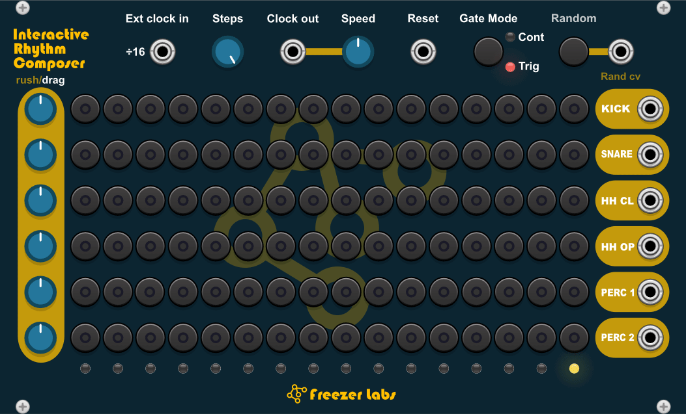
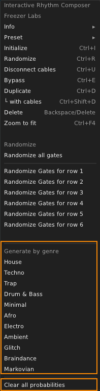
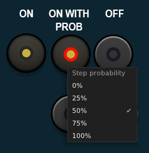

# Freezer Labs - Interactive Rhythm Composer for VCV Rack



6 row drum sequencer with per-row rush/drag controls, built-in clock, genre-based pattern generation, and per-step probability.

Based on the **James** module by [Daniel Davies](https://github.com/danieldavies99).

Modified and maintained by [AndyClotta](https://github.com/AndyClotta).

## Features

- 6 independent gate rows (16 steps each)
- Per-row Rush/Drag controls for swing and timing offsets
- Built-in internal clock with speed control
- External clock input with passthrough output
- Reset input
- Gate/Trigger mode switch
- Per-step probability (right-click any gate switch)
- Genre-based pattern generation (11 genres)
- Random pattern generation
- Random CV input for external randomization

## Usage

### Clock & Synchronization

The module expects a 64x clock resolution (64 pulses per quarter note). At 120 BPM, this translates to a 128 Hz clock signal.

Rather than stepping strictly on a coarse 16th-note grid, this 64 PPQN resolution gives the internal engine 16 tick positions per step, allowing it to apply precise micro-timing variations, humanization, and subtle off-grid feel across different musical styles without drifting.

### Right-click menu (module panel)

Right-click anywhere on the module panel to open the context menu:

| Action | Description |
|--------|-------------|
| **Randomize all gates** | Randomizes all 96 gate switches (6 rows × 16 steps) |
| **Randomize Gates for row 1–6** | Randomizes a single row independently |
| **Generate by genre** | Generates a pattern based on one of 11 genres: House, Techno, Trap, Drum & Bass, Minimal, Afro, Electro, Ambient, Glitch, Braindance, Markovian |
| **Clear all probabilities** | Resets all per-step probabilities to 100% (deterministic) |



### Per-step probability

Right-click any gate switch to set its trigger probability. The switch LED changes color to indicate the probability level:

| Probability | Switch LED |
|-------------|------------|
| 100% | Yellow (deterministic) |
| 75% / 50% / 25% | Red (probabilistic) |
| 0% | Off (never triggers) |

Active steps also show a yellow indicator light behind the switch.



## License

GPL-3.0-or-later. See [LICENSE](LICENSE) for details.

## Download

Descargá el plugin compilado desde [GitHub Releases](https://github.com/AndyClotta/Interactive-Rhythm-Composer/releases).

### Instalación

1. Descargá `FreezerLabs-1.1.0-win-x64.vcvplugin` del último release
2. Copiá el archivo a la carpeta de plugins de VCV Rack:
   - **Rack 2 Free**: `%LOCALAPPDATA%\Rack2\plugins-win-x64`
   - **Rack 2 Pro**: `%LOCALAPPDATA%\Rack2\plugins-win-x64`
3. Reiniciá VCV Rack
4. El módulo aparece como **Freezer Labs → Interactive Rhythm Composer**

## Building (para desarrolladores)

### Prerequisites

- [VCV Rack SDK](https://vcvrack.com/manual/PluginDevelopmentTutorial) (2.x)
- **Windows**: MSYS2 con `mingw-w64-x86_64-gcc` y `make`
- **macOS**: Xcode Command Line Tools (`xcode-select --install`)
- **Linux**: `build-essential` (GCC, make)

### Build

```bash
export RACK_DIR=/path/to/Rack-SDK
make install
```

El plugin compilado estará en `./dist/FreezerLabs/`.

### Instalación manual (todas las plataformas)

Copiá la carpeta `dist/FreezerLabs/` a:

| Plataforma | Ruta de plugins |
|---|---|
| **Windows** | `%LOCALAPPDATA%\Rack2\plugins-win-x64` |
| **macOS** | `~/Library/Application Support/Rack2/plugins-mac-arm64` (Apple Silicon) o `plugins-mac-x64` (Intel) |
| **Linux** | `~/.local/share/Rack2/plugins-lin-x64` |

## Contributing

Pull requests are welcome. For major changes, please open an issue first to discuss what you would like to change.

## Credits

- Original James module by [Daniel Davies](https://github.com/danieldavies99)
- Genre-based pattern generation adapted from the "Beat Agent" concept